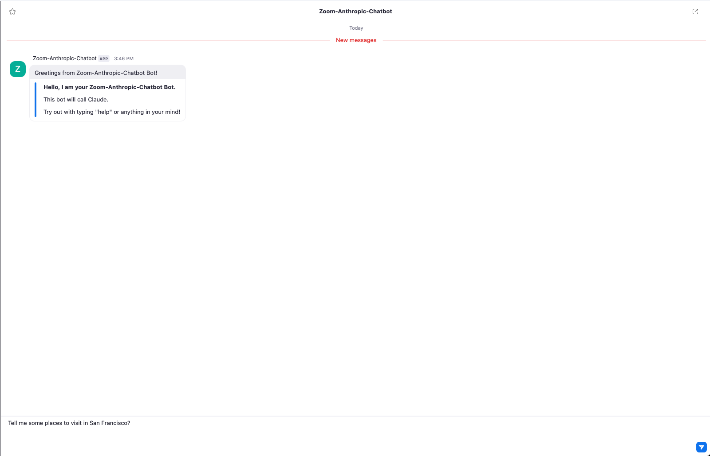
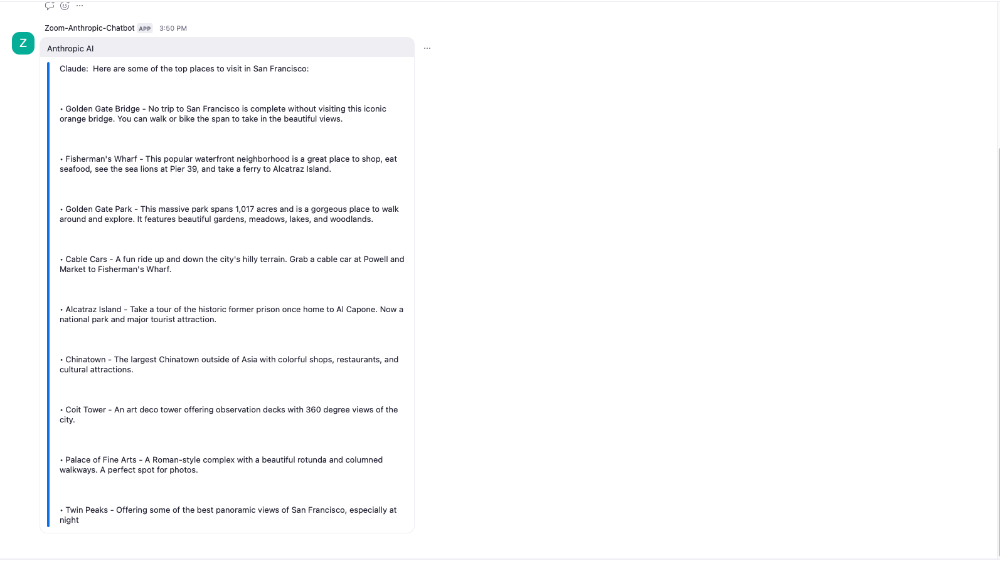
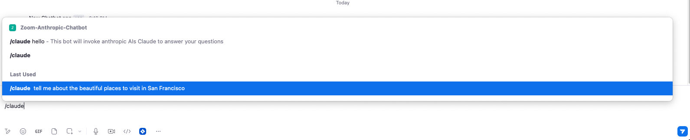

# Zoom-Anthropic-Chatbot

This project is a Zoom Team Chat App that uses the Anthropics API to provide responses in Zoom Team Chat. 

## Prerequisites

Before you can use this chatbot, you'll need the following:

- Node.js (version 12 or later)
- A Zoom account 
- An Anthropic AI account

## Setup

First, clone the repository:

git clone https://github.com/ojusave/Zoom-Anthropic-Chatbot.git
cd Zoom-Anthropic-Chatbot

Next, install the required Node.js packages:

npm install

## Configuration

You need to set up your environment variables. Create a `.env` file in the project root and add the following variables:

- ZOOM_CLIENT_ID=
- ZOOM_CLIENT_SECRET=
- ZOOM_BOT_JID=
- ZOOM_WEBHOOK_SECRET_TOKEN=
- ZOOM_VERIFICATION_CODE=
- ANTHROPIC_API_KEY=

To obtain these variables:

- For Zoom variables (ZOOM_CLIENT_ID, ZOOM_CLIENT_SECRET, ZOOM_BOT_JID, ZOOM_WEBHOOK_SECRET_TOKEN, ZOOM_VERIFICATION_CODE), refer to the [Zoom App Marketplace guide on creating a Team Chat app](https://developers.zoom.us/docs/team-chat-apps/create/).

- For the ANTHROPIC_API_KEY, you can obtain it by applying for access to Claude via the Anthropics [web console](https://console.anthropic.com/docs/api). Once you have access, you can generate API keys in your Account Settings.

## Running the Application

To start the application:

node index.js

The application will run on `http://localhost:4000/` by default, but you can set a different port by changing the `PORT` variable in your `.env` file.

## Usage

- In your Zoom Team Chat App's Credentials section, go to the Local Test or Submit page depending on which environment you are using (Development or Production), and click "Add". 
- After authorizing, you will be taken to Zoom Team Chat and see a message from the Zoom-Anthropic-Chatbot:  
"Greetings from Zoom-Anthropic-Chatbot Bot!"

- To use the bot type a message in the chat like this: 

"Tell me some places to visit in San Francisco?"

and your respose would look like this: 

If you want to use the bot in a chat or a channel, you can invoke the bot with a "/"

